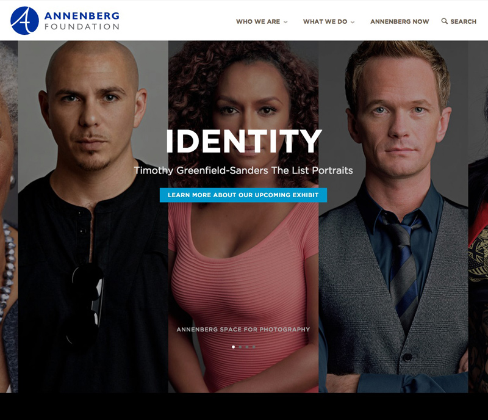
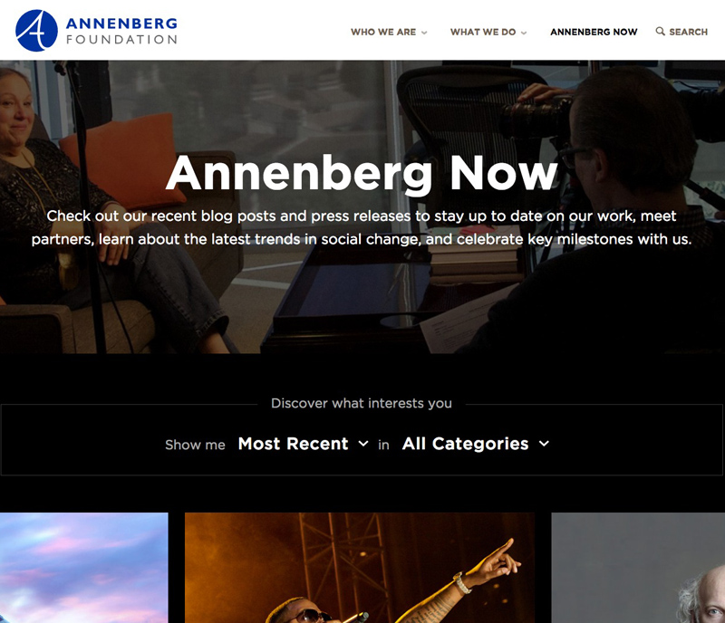
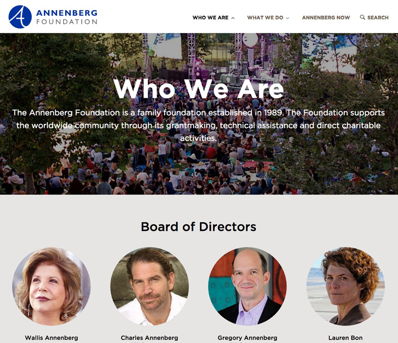
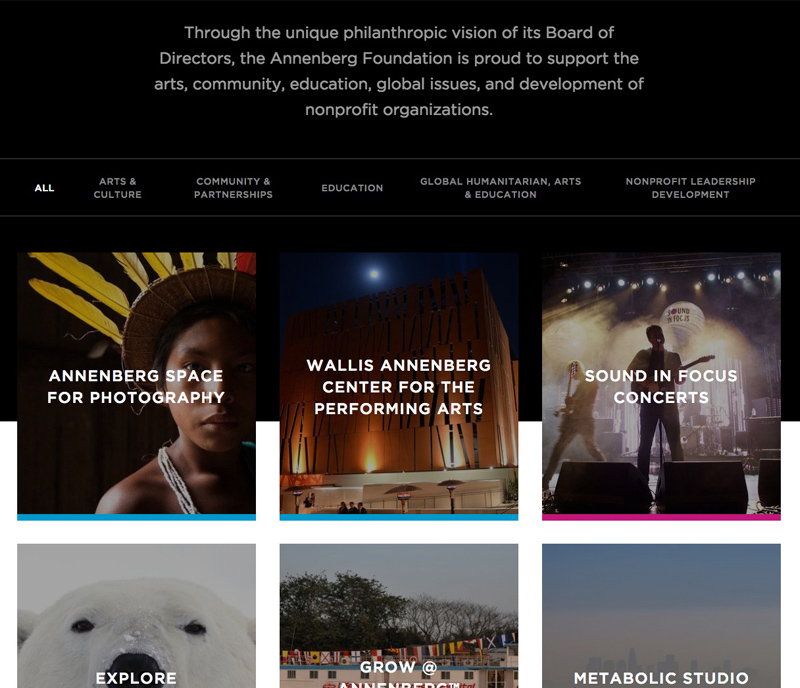

# {{ page.title }}

> The Annenberg Foundation is a family foundation established in 1989. The Foundation supports the worldwide community through its grantmaking, technical assistance and direct charitable activities.

I worked with [Advomatic](https://www.advomatic.com) to develop the new site for the Annenberg Foundation where I was responsible for front-end development and theming.

---

## Contributions

* Drupal 7.x Theme
* HTML / CSS / jQuery
* Consulting

---

**Launched:** {{ page.launch_date }} {{ page.site_link }}

---

