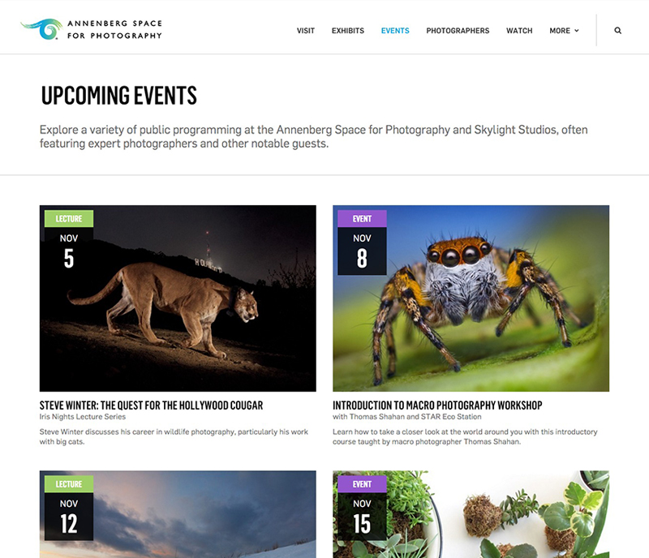
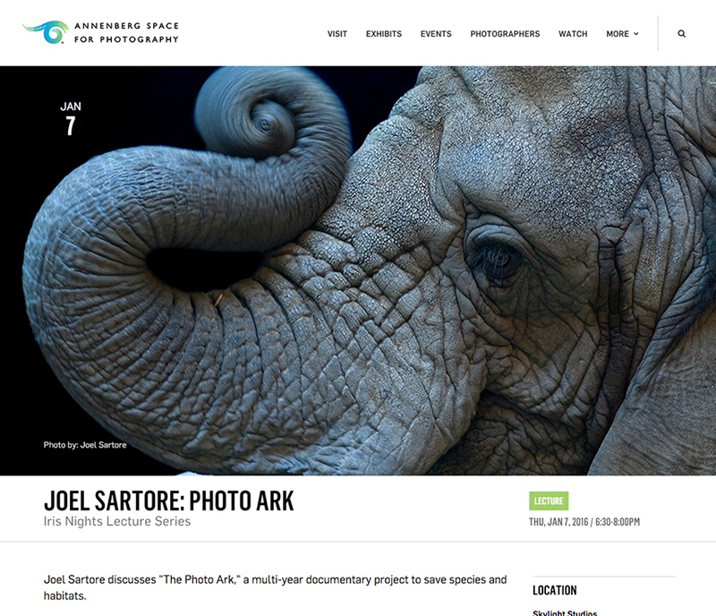
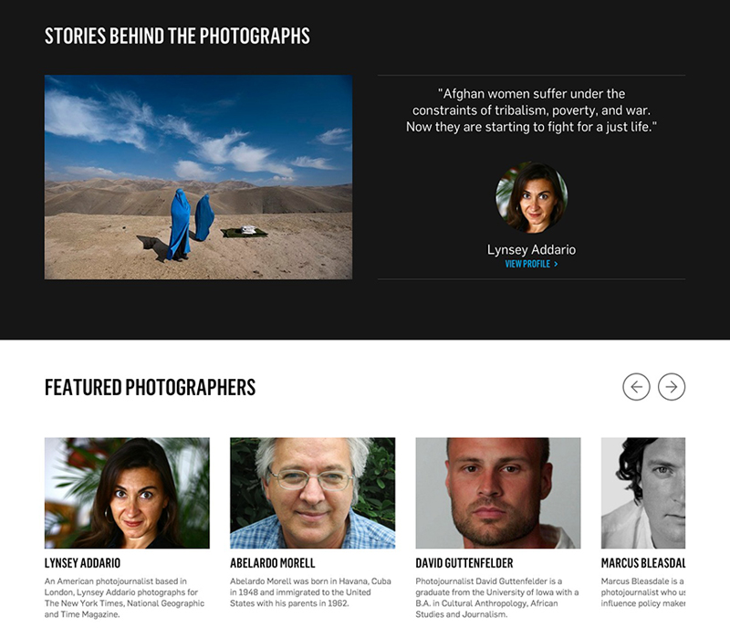

# {{ page.title }}

The Annenberg Space for Photography is a cultural destination dedicated to exhibiting both digital and print photography in an intimate environment. The space features state-of-the-art, high-definition digital technology as well as traditional prints by some of the world's most renowned photographers and a selection of emerging photographic talents as well. The venue, an initiative of the Annenberg Foundation and its trustees, is the first solely photographic cultural destination in the Los Angeles area, and it creates a new paradigm in the world of photography.

---

## Contributions

* Site development
* Drupal 7.x Theme
* HTML / CSS / jQuery
* User experience design
* Custom module development
* Custom administrative tools
* Consulting

---

**Launched:** {{ page.launch_date }} {{ page.site_link }}

---

---

## Live Demo

<iframe src='http://www.annenbergphotospace.org' style='border:0'></iframe>

