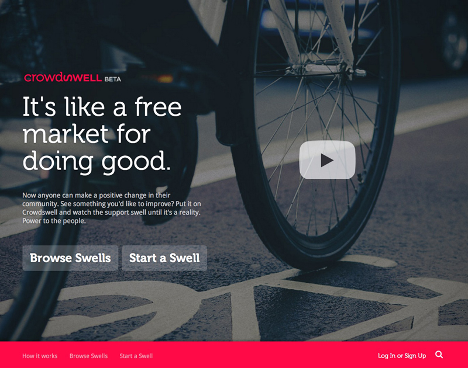
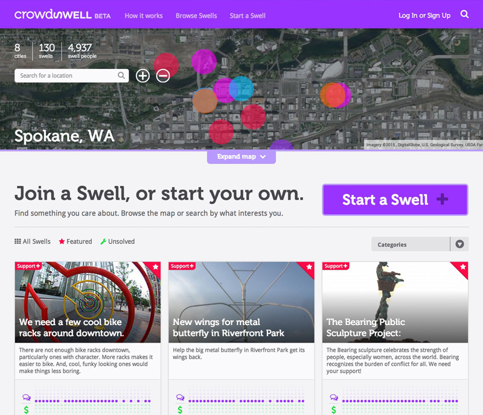
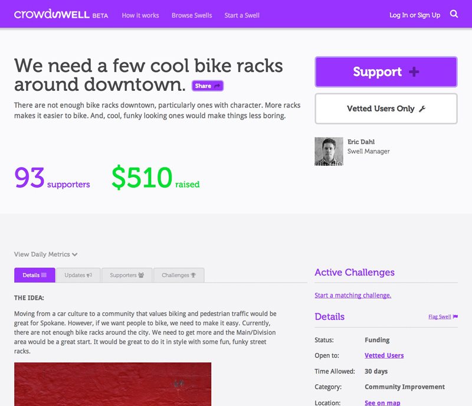

# {{ page.title }}

## Let's change the world. One Swell at a time.

It starts with one. One person. One idea. One issue. You see something you'd like to change in your neighborhood and enlist the help of others to make it happen. Welcome to Crowdswell, a platform that uses the power of the free market to turn good ideas into better communities.

We set out to build a marketplace for doing good. For getting things done and improving the lives of everyone along the way. Anyone could create an account and create a swell to get whatever they wanted changed. Others would then step up and accept the challenge and accomplish the task.

>**Crowdswell** is a marketplace for making communities better. It's a simple idea—when we align around a cause, we swell the demand for a solution. People, nonprofits, and companies unite around ideas, projects and causes they care about. Once the swell of support provides enough incentive, it gets done. Together, we are the solution.

---

## Contributions

* Custom theme
* HTML
* CSS
* jQuery
* UX/UI Design
* Consulting

---

**Launched:** {{ page.launch_date }} {{ page.site_link }}

---

---

## Live Demo

<iframe src='http://www.crowdswell.com/' style='border:0'></iframe>

