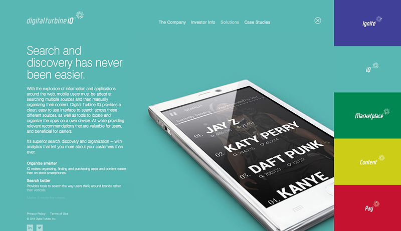
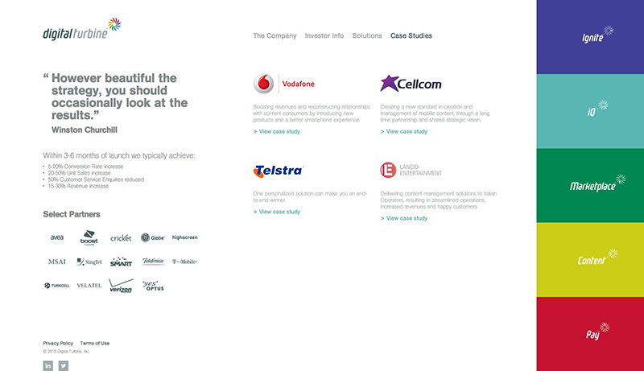

# {{ page.title }}

<blockquote>Digital Turbine powers the global mobile market with inventive end-to-end products and solutions that integrate seamlessly across multiple operating systems and networks.

With dozens of mobile operators around the world already as partners, Digital Turbine provides greater flexibility and control at every stage of the mobile user experience — from better app management, to a smarter way to search and shop. The end result is a more dynamic and efficient experience in the hands of customers. That’s 1.5 billion happier mobile users worldwide.</blockquote>

---

## Contributions

* Site development
* Drupal 7.x Theme
* HTML / CSS/ jQuery
* User experience design
* Consulting

---

**Launched:** {{ page.launch_date }} {{ page.site_link }}

---

---

## Live Demo

<iframe src='http://dev-archived-digital-turbine.pantheon.io' style='border:0'></iframe>

