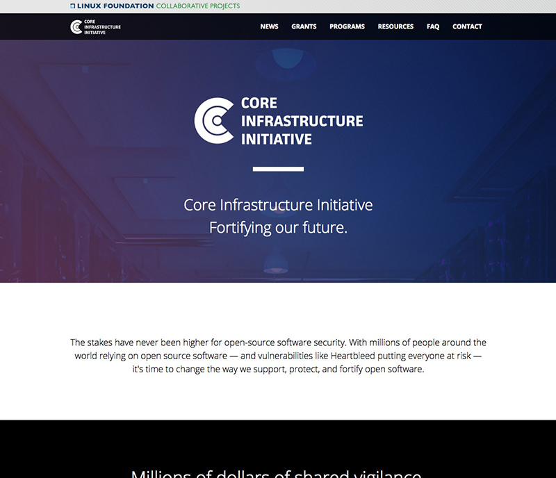
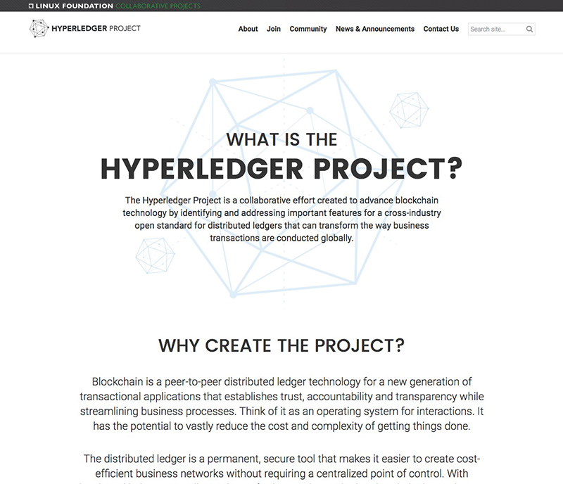

# {{ page.title }}

I contracted with the [Linux Foundation](http://wwws.linuxfoundation.org) for two years and was responsible for all of their front-end development and theming. I primarily worked with the Drupal framework and was responsible for 100+ [Collaborative Project sites](https://www.linuxfoundation.org/projects) in which I either built the theme for or supported by making custom changes.

I worked on [Linux Foundation](http://wwws.linuxfoundation.org) and all of their sub-sites ([Training](https://training.linuxfoundation.org), [Identity](https://identity.linuxfoundation.org), [Events](https://events.linuxfoundation.org)) and even [Linux.com](https://www.linux.com).

---

## Featured Projects

Here are a few sites where I was responsible for the entire build (site development and theming).

* [Code Aurora](https://www.codeaurora.org)
* [Core Infrastructure Initiative](https://www.coreinfrastructure.org)
* [Hyperledger Project](https://www.hyperledger.org)

---

## Contributions

* Drupal 6.x and 7.x Theme Development
* Support for 100+ Collaborative Project sites
* Custom base theme for use with other Collaborative Project sites
* Custom module development
* Custom Grunt and Gulp workflows
* Project planning and coordination
* Consulting and training
* Design direction
* UI Design

---

**Worked with from:** {{ page.launch_date }} {{ page.site_link }}

---

