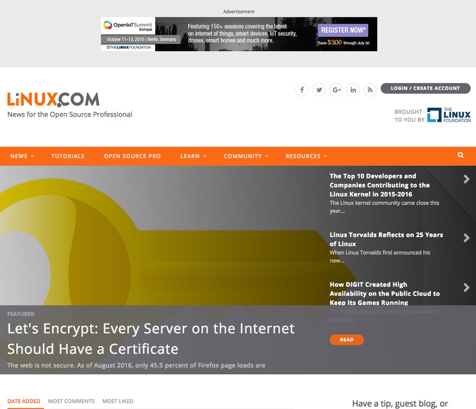
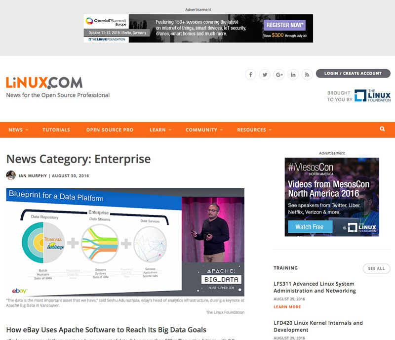

# {{ page.title }}

> Linux.com is the go-to resource for open source professionals to learn about the latest in Linux and open source technology, careers, best practices, and industry trends. Get news, information, and tutorials to help advance your next project or career – or simply scratch an itch.

While working with the [Linux Foundation](http://wwws.linuxfoundation.org) we redesigned and rebuilt the [Linux.com](http://wwws.linux.com) site. I was the lead front-end developer on this project and was responsible for taking an existing site with all of the data and content and panels layouts and creating a custom fully responsive theme within the Drupal framework. I worked closely with the lead designer as we designed and worked through the theme development process in only a month.

---

## Contributions

* Drupal 7.x Theme Development
* Design direction

---

**Launched:** {{ page.launch_date }} {{ page.site_link }}

---

