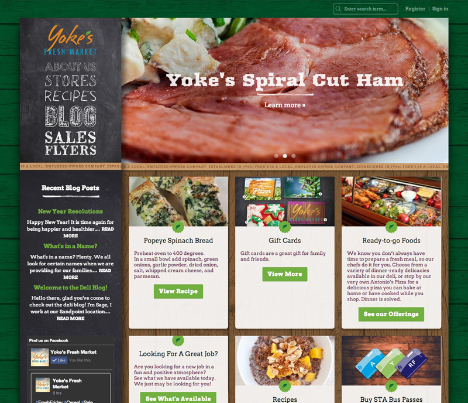
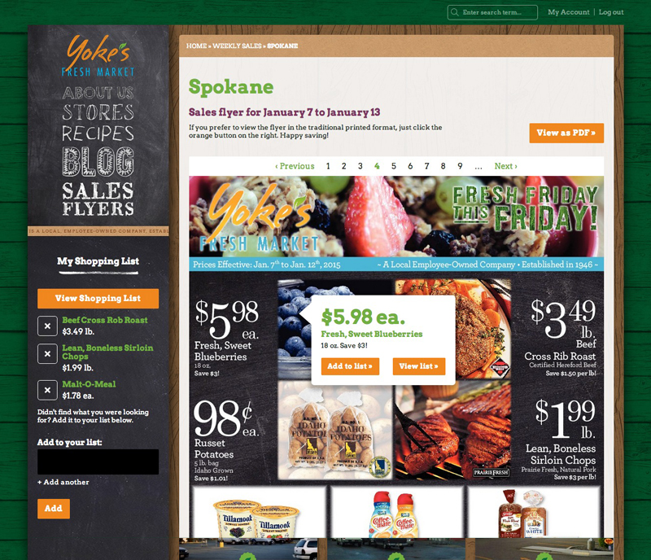
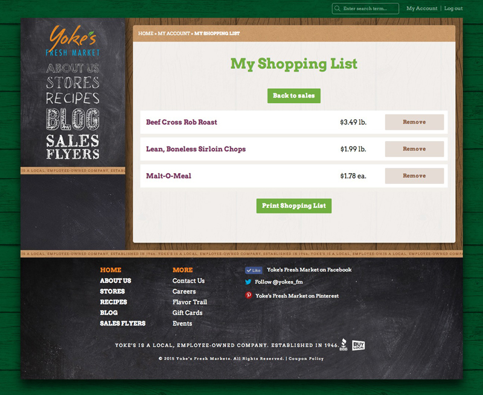
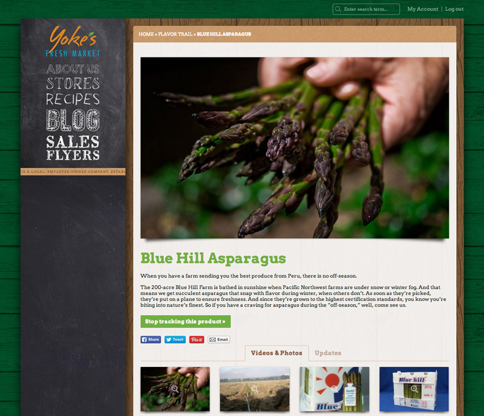
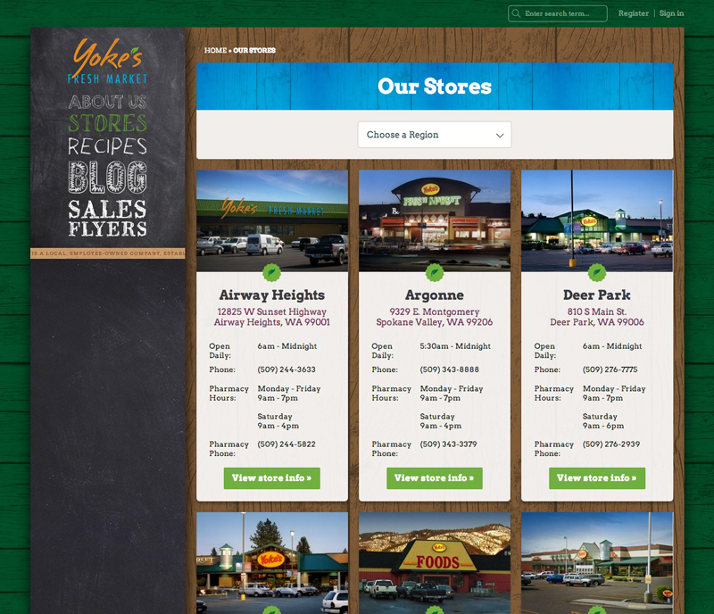

# {{ page.title }}

> <strong>Fresh products. And fresh thinking.</strong>  At Yoke's, being your neighborhood grocer is about more than stocking nature’s best products at a fair price - it's a promise to create a better experience, in and beyond the store. It's rounding up the freshest local products from area farms. It’s remaining locally owned, employee owned, and active in our communities. It’s a focus on environment, finding innovative ways to offer a greener shopping experience. But above all, it’s a commitment to help you live the fresh life.

---

## Contributions

* Site development
* Drupal 7.x Theme
* HTML
* CSS
* jQuery
* UX/UI Design
* Custom sales flyer and shopping list workflow
* Consulting

---

**Launched:** {{ page.launch_date }} {{ page.site_link }}

---

